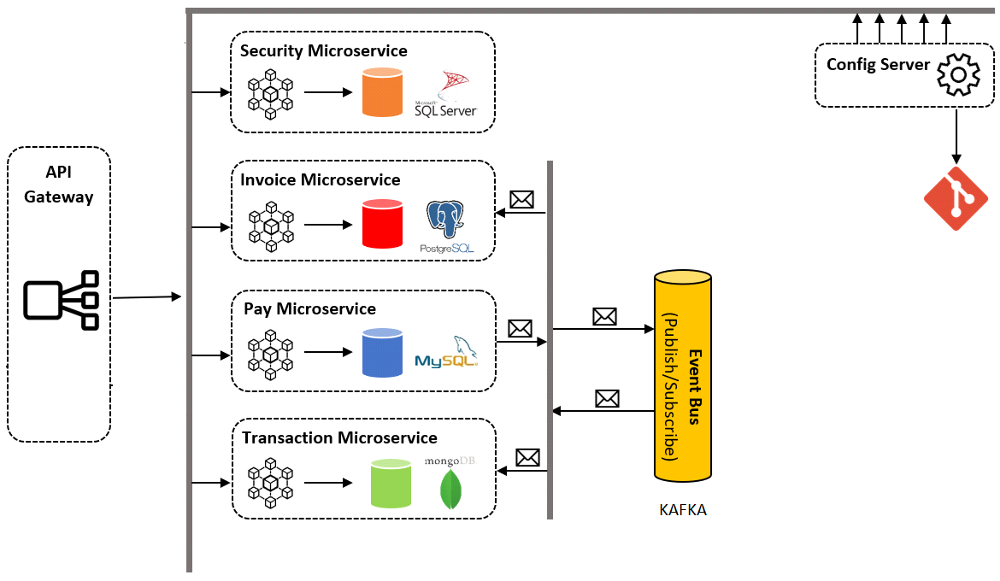

# PROYECTO

Se realizo los siguientes proyectos:
- aforo255.ms.test.invoice: Responsable de listar las facturas de clientes
- aforo255.ms.test.pay: Responsable de pagar una factura
- aforo255.ms.test.transaction: Responsable de listar las transacciones de una factura

En el cual se realizo lo siguiente: 
- Comunicaciones en una arquitectura de microservicios.
- Se separo la configuración del código de la aplicación con un Service Config.
- Bases de datos relaciones no relaciones.
- Se implemento una API Gateway para administrar el trafico de solicitudes.
- Se Dokeriza las aplicaciones.

## Bases de datos:
POSTGRES
BD:  db_invoice
```sh
CREATE TABLE invoices (
id_invoice serial not null,
amount decimal not null,
state int default 0,
PRIMARY KEY (id_invoice)
);
```
MYSQL
BD:  db_operation
```sh
create table operations(
   id_operation INT NOT NULL AUTO_INCREMENT,
   id_invoice INT NOT NULL,
   amount DECIMAL NOT NULL,
   date_operation DATETIME NOT NULL,	
   PRIMARY KEY (id_operation)
);
```
MONGO
BD:  db_transaction
CAMPOS:
```sh
id_transaccion
id_invoice int
amount 
date
```
```sh
```
## Creación de componentes:
- Una red de Docker llamada: aforo255-test
- El microservicio de invoces dockerizado se llamará: app-invoices
- El microservicio de pagos dockerizado se llamará: app-pay
- El microservicio de transacciones dockerizado se llamará: app-transaction
- Todos los servicios deben correr sobre la red aforo255-test

```sh
RED EN DOCKER 
docker network create aforo255-test

KAFKA 
docker run -p 2181:2181 -p 9092:9092 --name servicekafkatest --network aforo255-test -e ADVERTISED_HOST=127.0.0.1  -e NUM_PARTITIONS=3  -d johnnypark/kafka-zookeeper

MYSQL
docker run -p 3307:3306  --name microserviciotest-mysql8 --network aforo255-test -e MYSQL_ROOT_PASSWORD=123456 -e MYSQL_DATABASE=db_seguridad -d mysql:8

POSTGRESQL
docker run -p 5433:5432  --name microserviciotest-postgres12 --network aforo255-test -e POSTGRES_PASSWORD=123456 -e  POSTGRES_DB=db_account -d postgres:12-alpine
MONGO
docker run -p 27018:27017 --network aforo255-test --name mongodbtest -d mongo

configservertest
mvn clean package -DskipTests
docker build -t config-server-test .
docker run -p 8889:8889 --name configservertest --network aforo255-test -d config-server-test

security
mvn clean package -DskipTests
docker build -t ms-security .
docker run -p 8010:8010 --name mssecurity --network aforo255-test -d ms-security

app-invoices
mvn clean package -DskipTests
docker build -t app-invoices .
docker run -p 8007:8007 --name appinvoices --network aforo255-test -d app-invoices

app-pay
mvn clean package -DskipTests
docker build -t app-pay .
docker run -p 8008:8008 --name apppay --network aforo255-test -d app-pay

app-transaction
mvn clean package -DskipTests
docker build -t app-transaction .
docker run -p 8009:8009 --name apptransaction --network aforo255-test -d app-transaction

ms-gateway
mvn clean package -DskipTests
docker build -t ms-gateway .
docker run -p 8090:8090 --name msgateway --network aforo255-test -d ms-gateway
```
NOTA:  
•	Compartir un archivo con la configuracion de los enviroment del config server
[config-test](https://github.com/jhasmany/config-test/)
## Flujo del proyecto:
- El microservicio de invoices, debe listar las facturas de clientes y además debe consumir una cola para cambiar el estado de la factura cuando esta se paga a través del microservicio de pago.
- El microservicio de pago debe registrar el pago en su respectiva bd y además debe dejar un mensaje en una cola para actualizar la factura en el microservicio de facturas y además debe dejar un mensaje en una cola para registrar el movimiento en el microservicio de transacciones.
- El microservicio de transacciones debe listar las transacciones de una factura, además debe consumir una cola para obtener las transacciones de pago del microservicio de pago.
- Todos los microservicios deben consumir la cadena de conexión desde el servicio de configuración centralizada.